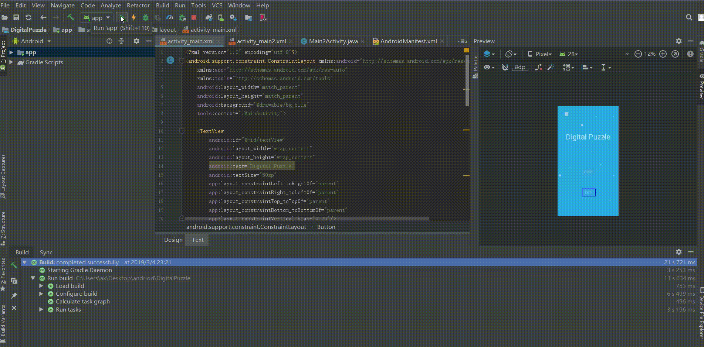

## DigitalPuzzle

This small game is to give a number between 1 and 100.

The players guess it.

Every player has an initial score of 10,which will minus 1 when player guesses the wrong number.

Game over when the score is 0.

Every time you guess wrong, you get a hint about the answer is bigger or smaller than random number.

